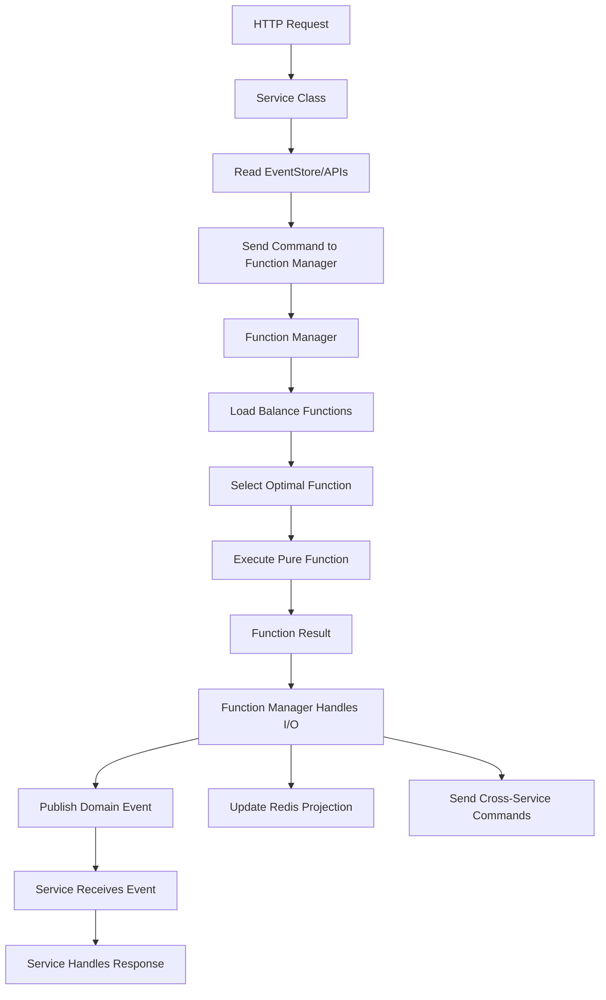

# Lucent Services Event-Driven Architecture Practices

**Document Version:** 1.0  
**Date:** 2025-09-03  
**Context:** Mandatory patterns for all Lucent Services microservices

## Overview

This document defines the **mandatory coding standards** for all services in the Lucent Services event-driven architecture. Following these patterns ensures world-class debugging, tracing, and operational excellence across the entire crypto trading platform.

## Setup Requirements

### 1. Install Infrastructure Package

Add to your microservice's `package.json`:

```json
{
  "dependencies": {
    "lucent-infrastructure": "^1.0.0",
    "@nestjs/core": "^10.0.0",
    "@nestjs/platform-fastify": "^10.0.0",
    "@nestjs/common": "^10.0.0"
  }
}
```

Install in your microservice:
```bash
npm install lucent-infrastructure
```

### 2. Environment Setup

Your microservice needs access to infrastructure services:

```yaml
# docker-compose.yml for your service
version: '3.8'
services:
  my-service:
    image: my-service:latest
    environment:
      - NATS_URL=nats://localhost:4222
      - KAFKA_BROKERS=localhost:9092
      - CLICKHOUSE_HOST=localhost:8123
      - KURRENTDB_CONNECTION=esdb://localhost:2113
      - REDIS_URL=redis://localhost:6379
    networks:
      - lucent-network

networks:
  lucent-network:
    external: true  # Connect to infrastructure network
```

## Service Architecture Requirements

### 1. Functional Core + Imperative Shell Pattern (MANDATORY)

All services **MUST** separate pure functions (functional core) from I/O operations (imperative shell):

#### Pure Functions (Functional Core)
```typescript
import { 
  EnhancedFunctionContext,
  EventHandler,
  ShardBy,
  ResourceRequirements
} from 'lucent-infrastructure';

/**
 * Pure function for yield farming calculations
 */
@EventHandler('YieldOpportunityDetected')
@ShardBy('protocol')
@ResourceRequirements({ cpu: 'medium', memory: '256MB', priority: 'high', timeout: 15000 })
export function calculateYieldStrategy(
  context: EnhancedFunctionContext,
  data: YieldOpportunityData
): YieldStrategy {
  
  context.logger.debug('Calculating yield strategy', {
    protocol: data.protocol,
    apy: data.apy,
    tvl: data.tvl
  });

  // Pure business logic - no side effects
  const riskAdjustedApy = data.apy * (1 - (data.riskScore / 10));
  const optimalAllocation = Math.min(riskAdjustedApy / 20, 0.5);
  
  const strategy = {
    protocol: data.protocol,
    allocation: optimalAllocation,
    confidence: calculateConfidence(data.historicalPerformance),
    exitStrategy: optimalAllocation > 0.3 ? 'gradual' : 'immediate'
  };

  // Context provides observability without side effects
  context.addMetadata('yield.risk_adjustment', data.riskScore / 10);
  context.addMetadata('yield.optimal_allocation', optimalAllocation);
  
  // Emit high-confidence opportunities
  if (strategy.confidence > 0.9) {
    context.emit('HighConfidenceYieldDetected', {
      protocol: data.protocol,
      confidence: strategy.confidence,
      allocation: strategy.allocation
    });
  }

  return strategy;
}

/**
 * Pure function for trade execution validation
 */
@EventHandler('TradeExecutionRequested')
@ShardBy('risk_level')
@ResourceRequirements({ cpu: 'low', memory: '128MB', priority: 'critical', timeout: 5000 })
export function validateTradeExecution(
  context: EnhancedFunctionContext,
  data: TradeExecutionData
): TradeValidationResult {
  
  // Pure validation logic
  const validationResult = {
    isValid: true,
    violations: [],
    riskScore: 0
  };

  // Validate amount
  if (data.amountUsd < 10) {
    validationResult.isValid = false;
    validationResult.violations.push({
      rule: 'minimum_amount',
      message: 'Trade amount below $10 minimum'
    });
  }

  // Validate risk level
  if (data.amountUsd > data.maxPositionSize) {
    validationResult.isValid = false;
    validationResult.violations.push({
      rule: 'position_limit',
      message: 'Trade exceeds maximum position size'
    });
  }

  context.addMetadata('validation.amount_usd', data.amountUsd);
  context.addMetadata('validation.violations', validationResult.violations.length);
  
  return validationResult;
}
```

#### Function Manager (Imperative Shell)
```typescript
import { 
  LucentServiceBase,
  BusinessContextBuilder,
  InfrastructureFactory
} from 'lucent-infrastructure';

/**
 * Function Manager handles I/O and coordinates pure functions
 */
class YieldFarmingFunctionManager extends LucentServiceBase {
  constructor() {
    const infrastructure = await InfrastructureFactory.createDefault();
    super(infrastructure, 'yield-farming-function-manager');
  }

  /**
   * Process yield opportunity events using pure functions
   */
  async processYieldOpportunity(event: DomainEvent<YieldOpportunityData>): Promise<void> {
    return this.handleDomainEvent(event, async (event, context) => {
      
      // 1. Execute pure function for yield calculation
      const functionContext = this.createEnhancedContext(context);
      const yieldStrategy = calculateYieldStrategy(functionContext, event.data);
      
      // 2. Handle I/O - store result in EventStore
      await this.publishDomainEvent(
        'YieldStrategyCalculated',
        `yield-strategy-${event.data.protocol}-${Date.now()}`,
        yieldStrategy,
        context.businessContext,
        context
      );
      
      // 3. Handle I/O - update Redis projection
      await this.updateYieldProjection(event.data.userId, yieldStrategy);
      
      // 4. Handle I/O - notify other services if high confidence
      if (yieldStrategy.confidence > 0.9) {
        await this.sendCommand(
          'portfolio-service',
          'ConsiderYieldStrategy',
          yieldStrategy,
          context.businessContext
        );
      }
    });
  }

  private async updateYieldProjection(userId: string, strategy: YieldStrategy): Promise<void> {
    // I/O: Update user's yield opportunities in Redis
    await this.infrastructure.cacheStore.hset(
      `user-yield:${userId}`,
      strategy.protocol,
      JSON.stringify({
        allocation: strategy.allocation,
        confidence: strategy.confidence,
        calculatedAt: Date.now()
      })
    );

    // Update global yield rankings
    await this.infrastructure.cacheStore.zadd(
      'yield-rankings',
      strategy.confidence * strategy.allocation,
      `${userId}:${strategy.protocol}`
    );
  }
}
```

### 2. Function Registration and Discovery (ENFORCED PATTERN)

**ALL pure functions MUST use decorators for automatic discovery:**

#### Pure Function Declaration
```typescript
/**
 * MANDATORY: All business functions use decorators
 */
@EventHandler('SwapRequested')
@ShardBy('trading_pair')
@ResourceRequirements({ cpu: 'high', memory: '512MB', priority: 'critical', timeout: 30000 })
export function executeSwapCalculation(
  context: EnhancedFunctionContext,
  data: SwapRequestData
): SwapCalculationResult {
  
  context.logger.info('Executing swap calculation', {
    trading_pair: data.pair,
    amount_usd: data.amountUsd,
    exchange: data.exchange
  });

  // Pure business logic - no side effects
  const slippageEstimate = calculateSlippage(data.amountUsd, data.liquidity);
  const feeEstimate = calculateFees(data.amountUsd, data.exchange);
  const priceImpact = calculatePriceImpact(data.amountUsd, data.orderBook);
  
  const swapCalculation = {
    expectedOutput: data.amountUsd / data.price,
    slippage: slippageEstimate,
    fees: feeEstimate,
    priceImpact: priceImpact,
    profitability: (1 - slippageEstimate - feeEstimate - priceImpact),
    executionRecommendation: (slippageEstimate + feeEstimate) < 0.005 ? 'execute' : 'wait'
  };

  context.addMetadata('swap.slippage_estimate', slippageEstimate);
  context.addMetadata('swap.fee_estimate', feeEstimate);
  context.addMetadata('swap.price_impact', priceImpact);
  
  // Emit execution recommendation
  context.emit('SwapCalculationCompleted', {
    tradeId: data.tradeId,
    recommendation: swapCalculation.executionRecommendation,
    profitability: swapCalculation.profitability
  });

  return swapCalculation;
}
```

#### Service Classes (Imperative Shell)
```typescript
/**
 * Service classes handle I/O and delegate to Function Manager
 */
class PortfolioService extends CryptoTradingServiceBase {
  constructor() {
    const infrastructure = await InfrastructureFactory.createDefault();
    super(infrastructure, 'portfolio-service');
  }

  /**
   * I/O Shell: Handle HTTP requests and coordinate with Function Manager
   */
  async executePortfolioUpdate(request: PortfolioUpdateRequest): Promise<PortfolioUpdateResult> {
    const businessContext = BusinessContextBuilder
      .forCryptoTrading()
      .withAggregate('Portfolio', request.userId)
      .withUser(request.userId)
      .build();

    return this.executeBusinessOperation('portfolio_update', businessContext, async (context) => {
      
      // 1. I/O: Read current state from EventStore
      const portfolioEvents = await this.infrastructure.eventStore.read(`portfolio-${request.userId}`);
      const riskProfile = await this.getUserRiskProfile(request.userId);
      
      // 2. I/O: Send calculation request to Function Manager
      const calculationRequest = await this.sendCommand<any, PortfolioCalculation>(
        'function-manager',
        'CalculatePortfolioUpdate',
        {
          eventType: 'PortfolioUpdateRequested',
          data: {
            currentEvents: portfolioEvents,
            newTrade: request.tradeData,
            riskProfile: riskProfile,
            timestamp: Date.now()
          }
        },
        context.businessContext
      );
      
      // 3. I/O: Handle Function Manager response
      if (calculationRequest.success) {
        
        // Store calculation result in EventStore
        await this.publishDomainEvent(
          'PortfolioCalculated',
          `portfolio-calc-${request.userId}`,
          calculationRequest.result,
          context.businessContext,
          context
        );
        
        // Update Redis projection
        await this.updatePortfolioProjection(request.userId, calculationRequest.result);
        
        // Send notifications if needed
        if (calculationRequest.result.riskLevelChanged) {
          await this.sendCommand(
            'notification-service',
            'SendRiskAlert',
            { userId: request.userId, newRiskLevel: calculationRequest.result.newRiskLevel },
            context.businessContext
          );
        }
      }
      
      return {
        success: calculationRequest.success,
        portfolio: calculationRequest.result,
        timestamp: Date.now()
      };
    });
  }

  /**
   * I/O: Update Redis projection from calculation result
   */
  private async updatePortfolioProjection(userId: string, portfolio: any): Promise<void> {
    const pipeline = this.infrastructure.cacheStore.pipeline();
    
    pipeline
      .hset(`portfolio:${userId}:positions`, 'data', JSON.stringify(portfolio.positions))
      .hset(`portfolio:${userId}:metadata`, 'totalValue', portfolio.totalValue.toString())
      .hset(`portfolio:${userId}:metadata`, 'lastUpdated', Date.now().toString())
      .zadd('portfolio-rankings', portfolio.totalValue, userId);

    await pipeline.exec();
  }
}

### 3. Compile-Time Function Registry (AUTO-GENERATED)

The build process **automatically generates** a typed function registry from decorated functions:

#### Generated Registry Example
```typescript
// AUTO-GENERATED - DO NOT EDIT
export const TYPED_FUNCTION_REGISTRY = {
  calculateYieldStrategy: {
    name: 'calculateYieldStrategy',
    eventTypes: ['YieldOpportunityDetected'],
    shardingStrategy: { type: 'protocol', value: null },
    resourceRequirements: { cpu: 'medium', memory: '256MB', priority: 'high', timeout: 15000 },
    execute: calculateYieldStrategy // TypeScript preserves exact signature
  },
  executeSwapCalculation: {
    name: 'executeSwapCalculation', 
    eventTypes: ['SwapRequested'],
    shardingStrategy: { type: 'trading_pair', value: null },
    resourceRequirements: { cpu: 'high', memory: '512MB', priority: 'critical', timeout: 30000 },
    execute: executeSwapCalculation
  },
  validateTradeExecution: {
    name: 'validateTradeExecution',
    eventTypes: ['TradeExecutionRequested'],
    shardingStrategy: { type: 'risk_level', value: null },
    resourceRequirements: { cpu: 'low', memory: '128MB', priority: 'critical', timeout: 5000 },
    execute: validateTradeExecution
  }
} as const;

// Type mapping for compile-time validation
export type EventToFunctionMapping = {
  'YieldOpportunityDetected': {
    input: YieldOpportunityData;
    output: YieldStrategy;
    functions: ['calculateYieldStrategy'];
  };
  'SwapRequested': {
    input: SwapRequestData;
    output: SwapCalculationResult;
    functions: ['executeSwapCalculation'];
  };
  'TradeExecutionRequested': {
    input: TradeExecutionData;
    output: TradeValidationResult;
    functions: ['validateTradeExecution'];
  };
};
```

#### Build Process Integration
```json
{
  "scripts": {
    "prebuild": "generate-function-registry",
    "build": "tsc",
    "generate-function-registry": "ts-node build-tools/generate-registry.ts"
  }
}
```

### 4. Service to Function Manager Connection

#### Standard Flow: Service → Function Manager → Pure Function

**ENFORCED PATTERN: All computation goes through Function Manager**

```typescript
/**
 * Services handle I/O and delegate computation to Function Manager
 */
class PortfolioService extends CryptoTradingServiceBase {
  async handleTradeExecuted(event: TradeExecutedEvent): Promise<void> {
    return this.handleDomainEvent(event, async (event, context) => {
      
      // 1. I/O: Read current state from EventStore
      const portfolioEvents = await this.infrastructure.eventStore.read(`portfolio-${event.data.userId}`);
      const riskProfile = await this.getUserRiskProfile(event.data.userId);
      
      // 2. I/O: Send computation request to Function Manager
      const calculationResult = await this.sendCommand<any, PortfolioCalculation>(
        'function-manager',
        'ExecuteFunction',
        {
          functionType: 'calculatePortfolioUpdate',
          eventType: 'PortfolioUpdateRequested', 
          data: {
            currentEvents: portfolioEvents,
            newTrade: event.data,
            riskProfile: riskProfile,
            timestamp: Date.now()
          }
        },
        context.businessContext
      );
      
      // 3. I/O: Handle calculation result
      if (calculationResult.success) {
        
        // Store result in EventStore
        await this.publishDomainEvent(
          'PortfolioUpdated',
          `portfolio-${event.data.userId}`,
          calculationResult.portfolio,
          context.businessContext,
          context
        );
        
        // Update Redis projection
        await this.updatePortfolioProjection(event.data.userId, calculationResult.portfolio);
        
        // Send notifications if needed
        if (calculationResult.portfolio.riskLevelChanged) {
          await this.sendCommand(
            'notification-service',
            'SendRiskAlert',
            calculationResult.riskAlert,
            context.businessContext
          );
        }
      }
    });
  }
}

/**
 * Generic Function Manager receives requests and orchestrates pure functions
 */
class GenericFunctionManager extends LucentServiceBase {
  constructor(
    private shardId: string,
    private availableShards: string[]
  ) {
    const infrastructure = await InfrastructureFactory.createDefault();
    super(infrastructure, `function-manager-${shardId}`);
  }

  /**
   * Handle function execution requests from services
   */
  async handleExecuteFunction(request: FunctionExecutionRequest): Promise<void> {
    return this.handleDomainEvent(request, async (request, context) => {
      
      // 1. Route to optimal shard based on function decorators
      const targetShard = await this.determineTargetShard(request.data);
      
      if (targetShard !== this.shardId) {
        return this.forwardToShard(targetShard, request);
      }

      // 2. Get functions from registry that can handle this event type
      const availableFunctions = this.getFunctionsForEvent(request.data.eventType);
      
      // 3. Select optimal function by load balancing
      const selectedFunction = await this.selectOptimalFunction(availableFunctions);
      
      // 4. Execute pure function with enhanced context
      const functionContext = this.createEnhancedFunctionContext(context);
      const result = selectedFunction.execute(functionContext, request.data.data);
      
      // 5. Handle function result - publish events and update projections
      await this.handleFunctionResult(selectedFunction.name, result, request.data.eventType, context);
      
      // 6. Send response back to requesting service
      await this.sendResponse(request.requestId, {
        success: true,
        result: result,
        functionName: selectedFunction.name,
        shardId: this.shardId
      });
    });
  }

  /**
   * Handle function results - EventStore + Redis + Commands
   */
  private async handleFunctionResult(
    functionName: string,
    result: any,
    originalEventType: string,
    context: EventProcessingContext
  ): Promise<void> {
    
    if (!result) return;

    // Store function result as domain event
    await this.publishDomainEvent(
      `${functionName}Completed`,
      `function-result-${context.correlationId}`,
      result,
      context.businessContext,
      context
    );

    // Update Redis projections based on function result
    await this.updateProjectionsFromResult(result, context);
    
    // Send commands to other services if needed
    await this.processResultCommands(result, context);
  }
}
```

### 5. Complete Event Flow Architecture



**Key Benefits of Service → Function Manager → Pure Function Flow:**
- ✅ **Services focus on I/O**: HTTP, databases, external APIs
- ✅ **Function Manager optimizes computation**: Load balancing, shard routing
- ✅ **Pure functions stay pure**: No I/O concerns, easily testable
- ✅ **Dynamic load balancing**: Functions execute on optimal shards
- ✅ **Consistent patterns**: All computation follows same flow

### 6. Event Handling (ENFORCED PATTERN)

```typescript
class PortfolioService extends CryptoTradingServiceBase {
  async handleTradeExecuted(event: TradeExecutedEvent): Promise<void> {
    // ENFORCED: Use handleDomainEvent wrapper
    return this.handleDomainEvent(event, async (event, context) => {
      // Your event handling logic here
      const portfolio = await this.updatePortfolio(event.data);
      
      // Publish resulting events through framework
      await this.publishDomainEvent(
        'PortfolioUpdated',
        `portfolio-${event.data.userId}`,
        portfolio,
        context.businessContext,
        context
      );
    });
  }
}
```

### 5. Cross-Service Communication (MANDATORY PATTERN)

```typescript
class YieldService extends CryptoTradingServiceBase {
  async requestRiskAssessment(yieldData: YieldData): Promise<RiskAssessment> {
    const businessContext = BusinessContextBuilder
      .forYieldFarming()
      .withAggregate('YieldAnalysis', `analysis-${yieldData.id}`)
      .withUser(yieldData.userId)
      .withProtocol(yieldData.protocol)
      .build();

    // ENFORCED: Use sendCommand for service communication
    return this.sendCommand<YieldData, RiskAssessment>(
      'risk-assessment',        // Target service
      'AssessYieldRisk',       // Command type
      yieldData,               // Command data
      businessContext,         // Business context (REQUIRED)
      15000                    // Timeout
    );
  }
}
```

### 6. Multi-Step Business Processes (ENFORCED PATTERN)

```typescript
class YieldOptimizationService extends CryptoTradingServiceBase {
  async optimizeYieldStrategy(request: OptimizeRequest): Promise<Strategy> {
    const businessContext = BusinessContextBuilder
      .forYieldFarming()
      .withAggregate('YieldStrategy', `strategy-${request.strategyId}`)
      .withUser(request.userId)
      .withAmount(request.portfolioValueUsd)
      .build();

    // ENFORCED: Multi-step processes use executeBusinessProcess
    return this.executeBusinessProcess('yield_optimization', businessContext, [
      {
        name: 'analyze_current_positions',
        execute: async (context) => {
          return this.analyzeCurrentPositions(request.userId);
        }
      },
      {
        name: 'identify_yield_opportunities', 
        execute: async (context, currentPositions) => {
          return this.findYieldOpportunities(currentPositions);
        }
      },
      {
        name: 'assess_risks',
        execute: async (context, opportunities) => {
          return this.assessRisks(opportunities);
        }
      },
      {
        name: 'generate_strategy',
        execute: async (context, riskAssessment) => {
          return this.generateOptimalStrategy(riskAssessment);
        }
      }
    ]);
  }
}
```

## OpenTelemetry Integration Benefits

### Automatic Tracing Attributes

Every operation automatically gets:

```json
{
  "business.domain": "crypto-trading",
  "business.bounded_context": "yield-farming", 
  "business.aggregate_type": "YieldStrategy",
  "business.aggregate_id": "strategy-abc123",
  "business.user_id": "user-456",
  "business.workflow_id": "yield-workflow-789",
  "business.process_name": "yield_optimization",
  "business.step_number": 3,
  "business.total_steps": 4,
  
  "crypto.trading_pair": "ETH-USDC",
  "crypto.exchange": "binance",
  "crypto.protocol": "aave",
  "crypto.amount_usd": 50000,
  "crypto.risk_level": "medium",
  "crypto.strategy_type": "yield-farming",
  
  "event.type": "YieldOpportunityDetected",
  "event.stream_id": "yield-analysis-abc123",
  "event.correlation_id": "corr-456-789",
  "event.causation_id": "event-123-456",
  
  "service.name": "yield-farming",
  "service.operation": "business_operation",
  
  "request.id": "req-789-012",
  "request.source": "yield-farming"
}
```

### Cross-Service Context Propagation

Business context automatically flows through:
```
HTTP Request → Service A → NATS Command → Service B → EventStore → Projection Update
    ↓              ↓             ↓             ↓           ↓              ↓
workflow-123 → workflow-123 → workflow-123 → workflow-123 → workflow-123 → workflow-123
user-456     → user-456     → user-456     → user-456     → user-456     → user-456
ETH-USDC     → ETH-USDC     → ETH-USDC     → ETH-USDC     → ETH-USDC     → ETH-USDC
```

## Event Naming Conventions (MANDATORY)

### Domain Events
```typescript
// Pattern: {AggregateType}{Action}{Result}
'UserCreated'              // User creation completed
'TradeExecuted'            // Trade execution completed  
'YieldOpportunityDetected' // Yield opportunity found
'RiskAssessmentCompleted'  // Risk analysis finished
'PortfolioRebalanced'      // Portfolio rebalancing done
'AlertTriggered'           // Alert condition met
```

### NATS Subjects
```typescript
// Pattern: lucent.events.domain.{domain}.{EventType}
'lucent.events.domain.crypto_trading.TradeExecuted'
'lucent.events.domain.yield_farming.YieldOpportunityDetected'  
'lucent.events.domain.user_management.UserCreated'

// Commands: lucent.commands.{service}.{CommandType}
'lucent.commands.risk_assessment.AssessYieldRisk'
'lucent.commands.trading.ExecuteSwap'
'lucent.commands.portfolio.Rebalance'
```

### EventStore Streams
```typescript
// Pattern: {aggregate-type}-{aggregate-id}
'user-123'                    // User aggregate events
'trade-abc123'               // Trade aggregate events
'portfolio-user-456'         // User portfolio events
'yield-analysis-789'         // Yield analysis events
'risk-assessment-xyz'        // Risk assessment events
```

## Debugging Capabilities

### Find All Events for User
```bash
# Jaeger query
service.name="*" AND business.user_id="user-123"
```

### Trace Complete Yield Farming Decision
```bash  
# Jaeger query
business.workflow_id="yield-workflow-789"
```

### Find All High-Risk Trades
```bash
# Jaeger query
crypto.risk_level="high" AND business.domain="crypto-trading"
```

### Track Multi-Service Process
```bash
# Jaeger query  
business.process_name="yield_optimization" AND business.workflow_id="workflow-123"
```

## Error Handling Requirements

### Structured Error Context
```typescript
try {
  await this.executeYieldStrategy(data);
} catch (error) {
  // ENFORCED: Errors automatically include business context
  this.logger.error('Yield strategy execution failed', {
    strategy_id: data.strategyId,
    user_id: data.userId,
    protocol: data.protocol,
    error: error.message,
    correlation_id: context.correlationId
  }, error);
  
  // Framework automatically adds error to trace with business context
  throw error; // Error bubbles up with full context
}
```

## Performance Monitoring

### Automatic SLA Tracking
```typescript
// Framework automatically tracks:
// - Business process completion times
// - Cross-service call latencies  
// - Event processing performance
// - Error rates by business domain
// - Resource utilization per workflow
```

## Development Workflow

### 1. Create Service
```typescript
// Extend appropriate base class
class MyService extends CryptoTradingServiceBase {
  // Framework provides all infrastructure
}
```

### 2. Define Operations  
```typescript
async myBusinessOperation(request: MyRequest): Promise<MyResult> {
  // Build business context
  const context = BusinessContextBuilder.forCryptoTrading()...;
  
  // Use enforced pattern
  return this.executeBusinessOperation('my_operation', context, async (ctx) => {
    // Your logic here
    return result;
  });
}
```

### 3. Handle Events
```typescript
async handleSomeEvent(event: SomeEvent): Promise<void> {
  // Use enforced pattern  
  return this.handleDomainEvent(event, async (event, context) => {
    // Your event handling logic
  });
}
```

### 4. Debug Issues
- Open Jaeger UI: http://localhost:16686
- Search by user ID, workflow ID, or business domain
- See complete end-to-end traces with business context
- Correlate technical failures to business impact

## Benefits

### For Developers
- ✅ **No tracing setup required** - automatic with base classes
- ✅ **Consistent patterns** - same approach across all services
- ✅ **Type safety** - compile-time validation of business context
- ✅ **Auto-completion** - IDE guides proper usage

### For Operations  
- ✅ **Perfect debugging** - trace any business process end-to-end
- ✅ **Business metrics** - SLAs tracked automatically
- ✅ **Error correlation** - link technical failures to business impact
- ✅ **Performance optimization** - identify bottlenecks by business process

### For Product
- ✅ **User journey tracking** - see complete user experience
- ✅ **Feature performance** - measure business process success rates
- ✅ **Issue resolution** - faster debugging means better user experience
- ✅ **Data insights** - rich business context for analytics

## Compliance

### MANDATORY Requirements
- ✅ All services MUST extend base classes
- ✅ All business operations MUST use business context
- ✅ All domain events MUST follow naming conventions  
- ✅ All cross-service calls MUST use framework methods
- ✅ All error handling MUST preserve business context

### Code Review Checklist
- [ ] Service extends appropriate base class?
- [ ] Business context provided for all operations?
- [ ] Domain events use proper naming convention?
- [ ] Cross-service calls use sendCommand pattern?
- [ ] Event handlers use handleDomainEvent wrapper?
- [ ] Error handling preserves business context?

## Examples

### Complete Trading Service Example
```typescript
class TradingService extends CryptoTradingServiceBase {
  async executeArbitrageStrategy(request: ArbitrageRequest): Promise<ArbitrageResult> {
    // 1. Build business context
    const context = BusinessContextBuilder
      .forCryptoTrading()
      .withAggregate('ArbitrageTrade', request.tradeId)
      .withUser(request.userId)
      .withTradingPair(request.tradingPair)
      .withAmount(request.amountUsd)
      .withWorkflow(`arbitrage-${request.tradeId}`)
      .withMetadata('strategy', 'cross-exchange-arbitrage')
      .build();

    // 2. Execute with enforced pattern
    return this.executeBusinessOperation('arbitrage_execution', context, async (ctx) => {
      // 3. Multi-step process with automatic tracing
      return this.executeBusinessProcess('arbitrage_strategy', context, [
        {
          name: 'detect_opportunity',
          execute: async (ctx) => {
            const opportunity = await this.detectArbitrageOpportunity(request.tradingPair);
            
            await this.publishDomainEvent(
              'ArbitrageOpportunityDetected',
              `arbitrage-${request.tradeId}`,
              opportunity,
              context,
              ctx
            );
            
            return opportunity;
          }
        },
        {
          name: 'assess_risk',
          execute: async (ctx, opportunity) => {
            const riskAssessment = await this.sendCommand<any, RiskAssessment>(
              'risk-assessment',
              'AssessArbitrageRisk', 
              { opportunity, tradingPair: request.tradingPair },
              context
            );
            
            return riskAssessment;
          }
        },
        {
          name: 'execute_trades',
          execute: async (ctx, riskAssessment) => {
            if (riskAssessment.riskLevel === 'high') {
              throw new Error('Risk level too high for execution');
            }
            
            const result = await this.executeCrossExchangeTrades(request, riskAssessment);
            
            await this.publishDomainEvent(
              'ArbitrageTradeExecuted',
              `arbitrage-${request.tradeId}`,
              result,
              context,
              ctx
            );
            
            return result;
          }
        }
      ]);
    });
  }

  // Event handler example
  async handleMarketPriceUpdate(event: MarketPriceUpdatedEvent): Promise<void> {
    return this.handleDomainEvent(event, async (event, context) => {
      // Check for new arbitrage opportunities
      if (this.shouldCheckArbitrage(event.data)) {
        const opportunities = await this.scanForArbitrageOpportunities(event.data.tradingPair);
        
        for (const opportunity of opportunities) {
          await this.publishDomainEvent(
            'ArbitrageOpportunityDetected',
            `arbitrage-opportunity-${Date.now()}`,
            opportunity,
            context.businessContext,
            context
          );
        }
      }
    });
  }
}
```

### Complete Event Flow Example

```typescript
// 1. Market data arrives via Kafka → ClickHouse
// 2. Price update triggers arbitrage detection
class ArbitrageDetectionService extends CryptoTradingServiceBase {
  async detectOpportunities(priceUpdate: PriceUpdateEvent): Promise<void> {
    const context = BusinessContextBuilder
      .forCryptoTrading()
      .withAggregate('ArbitrageAnalysis', `analysis-${Date.now()}`)
      .withTradingPair(priceUpdate.tradingPair)
      .withWorkflow(`arbitrage-detection-${Date.now()}`)
      .build();

    return this.executeBusinessOperation('detect_arbitrage', context, async (ctx) => {
      const opportunities = await this.findArbitrageOpportunities(priceUpdate);
      
      for (const opportunity of opportunities) {
        await this.publishDomainEvent(
          'ArbitrageOpportunityDetected', 
          `arbitrage-${opportunity.id}`,
          opportunity,
          context,
          ctx
        );
      }
    });
  }
}

// 3. Arbitrage opportunity triggers risk assessment
class RiskAssessmentService extends CryptoTradingServiceBase {
  async handleArbitrageOpportunity(event: ArbitrageOpportunityDetectedEvent): Promise<void> {
    return this.handleDomainEvent(event, async (event, context) => {
      const assessment = await this.assessArbitrageRisk(event.data);
      
      await this.publishDomainEvent(
        'ArbitrageRiskAssessed',
        `risk-${event.data.opportunityId}`,
        assessment,
        context.businessContext,
        context
      );
    });
  }
}

// 4. Risk assessment triggers trade execution
class TradingExecutionService extends CryptoTradingServiceBase {
  async handleArbitrageRiskAssessed(event: ArbitrageRiskAssessedEvent): Promise<void> {
    return this.handleDomainEvent(event, async (event, context) => {
      if (event.data.riskLevel === 'low') {
        const trades = await this.executeArbitrageTrades(event.data);
        
        await this.publishDomainEvent(
          'ArbitrageTradesExecuted',
          `trades-${event.data.opportunityId}`, 
          trades,
          context.businessContext,
          context
        );
      }
    });
  }
}
```

## Debugging Examples

### Find Complete User Journey
```bash
# In Jaeger UI, search:
business.user_id="user-123"

# Results show:
1. UserCreated → user-management service
2. PortfolioCreated → portfolio service  
3. YieldOpportunityDetected → yield-farming service
4. RiskAssessed → risk-assessment service
5. TradeExecuted → trading service
6. PortfolioUpdated → portfolio service
```

### Debug Failed Arbitrage Strategy
```bash
# Search by workflow:
business.workflow_id="arbitrage-workflow-456"

# See complete process:
Step 1: detect_opportunity ✅ 50ms
Step 2: assess_risk ✅ 200ms  
Step 3: execute_trades ❌ FAILED - "Insufficient liquidity"
  ↳ Error details: Exchange XYZ liquidity too low
  ↳ Business impact: $50,000 arbitrage opportunity missed
  ↳ Recommended action: Increase liquidity threshold
```

### Performance Analysis
```bash
# Find slow yield farming processes:
business.process_name="yield_optimization" AND operation.duration_ms>30000

# Results:
- 95% complete under 15 seconds ✅
- 4% take 15-30 seconds ⚠️ 
- 1% timeout after 30 seconds ❌ (investigate ClickHouse query performance)
```

## Summary

This opinionated framework **enforces world-class patterns** while providing **effortless debugging** for event-driven architecture. Every business process becomes traceable, every error includes business context, and every performance issue can be correlated to business impact.

**Compliance with these patterns is MANDATORY** for all Lucent Services to ensure operational excellence and debugging capabilities that surpass any major tech company.