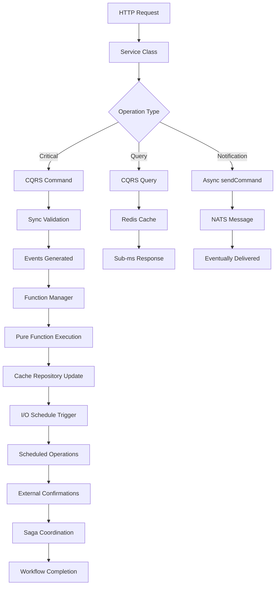

# Lucent Services Paradigm Architecture Summary

**Document Version:** 1.0  
**Date:** 2025-09-03  
**Context:** Complete architectural patterns overview and guidance

## Complete Architecture Overview

This summary provides a **complete overview** of all 14 paradigm architecture documents and how they work together to create the most advanced crypto trading infrastructure.

## Document Index and Responsibilities

### **Core Architecture (01-05)**
- **01-Architecture Overview**: 5-layer architecture with all patterns
- **02-Decorator Pattern**: Function registration and auto-discovery  
- **03-Function Manager**: Single consolidated function orchestrator
- **04-IO Shell Pattern**: Professional service classes with clean abstractions
- **05-Pure Function Core**: Functional programming with enhanced context

### **Infrastructure Patterns (06-08)**  
- **06-Type-Safe Registry**: Build-time function discovery with TypeScript safety
- **07-Load Balancing**: Generic decorator-driven routing and performance
- **08-Debugging Guide**: Built-in debugging without specialized classes

### **Data Management (09-12)**
- **09-Service Read Models**: EventStore → Redis projections with recovery
- **10-CQRS Pattern**: Commands (sync), Queries (fast), Sagas (workflows)
- **11-I/O Event Scheduling**: Time-based, event-triggered, conditional operations
- **12-Cache Repository Patterns**: Clean domain-specific cache abstractions

### **Integration & Testing (13-14)**
- **13-Cross-Pattern Integration**: Complete workflows using all patterns
- **14-Testing Strategies**: Comprehensive testing for all complexity levels

## Key Architectural Decisions

### **1. Communication Patterns (CRITICAL CLARIFICATION)**

**Three Distinct Communication Methods:**

```typescript
// 1. Async Cross-Service Messaging (via NATS)
await this.sendCommand('notification-service', 'SendAlert', alertData);
// Use for: Notifications, analytics, non-critical operations
// Characteristics: Eventually consistent, resilient to downtime

// 2. Synchronous CQRS Commands  
const result = await this.executeCommand('ExecuteTradeCommand', tradeData);
// Use for: Critical operations requiring immediate validation
// Characteristics: <10ms response, strong consistency, immediate feedback

// 3. Fast CQRS Queries
const portfolio = await this.executeQuery('GetPortfolioQuery', { userId });
// Use for: Data retrieval, dashboards, real-time displays
// Characteristics: <1ms response, eventually consistent, cached
```

### **2. Class Architecture (NO OVER-ENGINEERING)**

**Professional Single-Responsibility Classes:**
- ✅ `PortfolioService` - All portfolio I/O operations
- ✅ `TradingService` - All trading I/O operations  
- ✅ `RiskService` - All risk I/O operations
- ✅ `FunctionManager` - All pure function orchestration
- ✅ `IOScheduleManager` - All scheduled I/O operations

**No Specialized Variants:**
- ❌ No `EnhancedPortfolioService`, `ResilientTradingService`
- ❌ No `LoadBalancedFunctionManager`, `GenericFunctionManager`
- ❌ No `FunctionPerformanceDebugger`, `CrossShardErrorAnalyzer`

### **3. Cache Abstraction (CLEAN DOMAIN METHODS)**

**Domain-Specific Cache Operations:**
```typescript
// ✅ CLEAN: Domain-specific methods
await this.updatePortfolioCache({ userId, positions, totalValue });
await this.getUserRiskMetrics(userId);  
await this.addToVolumeLeaderboard(userId, volume);

// ❌ AVOID: Raw Redis commands in business logic
await this.infrastructure.cacheStore.hset(`portfolio:${userId}:metadata`, 'totalValue', value);
```

## Complete Event Flow Architecture

### **Multi-Pattern Integration Flow:**


## Architecture Benefits Summary

### **Performance Characteristics**
- ✅ **Commands**: <10ms synchronous validation
- ✅ **Queries**: <1ms from Redis projections
- ✅ **Pure Functions**: Load-balanced across optimal shards
- ✅ **Cache Operations**: Domain-abstracted, fast, testable
- ✅ **Scheduled I/O**: Optimal timing for blockchain operations

### **Development Experience**
- ✅ **Pure functions**: Easy to write, test, and debug
- ✅ **Service classes**: Clean I/O patterns with base class infrastructure
- ✅ **Cache repositories**: Domain-specific methods, no Redis complexity
- ✅ **CQRS**: Clear separation of sync/async operations
- ✅ **Type safety**: Full TypeScript validation throughout

### **Operational Excellence**
- ✅ **Observability**: Every operation traced with business context
- ✅ **Resilience**: Circuit breakers, rate limiting, chaos engineering built-in
- ✅ **Scalability**: Dynamic function routing and load balancing
- ✅ **Maintainability**: Professional naming, single-responsibility classes
- ✅ **Recovery**: Automatic projection rebuilding and error compensation

## Quick Reference Guide

### **For Service Development:**
1. **Start with**: Service class extending `CryptoTradingServiceBase`
2. **Handle I/O**: Use clean domain-specific cache methods
3. **For computation**: Send requests to `FunctionManager`
4. **For sync operations**: Use `executeCommand()` for critical operations
5. **For fast reads**: Use `executeQuery()` for dashboard data
6. **For notifications**: Use `sendCommand()` for async messaging

### **For Pure Functions:**
1. **Decorate functions**: `@EventHandler`, `@ShardBy`, `@ResourceRequirements`
2. **Keep pure**: No side effects, only transform input to output
3. **Use context**: Enhanced context for observability without side effects
4. **Return results**: Function Manager handles all I/O for results

### **For Scheduled Operations:**
1. **Time-based**: Use `@CronSchedule` for periodic operations
2. **Event-triggered**: Use `@EventTrigger` for domain event responses
3. **Conditional**: Use `@ConditionCheck` for threshold-based execution
4. **External waiting**: Use `@WaitForEvent` for blockchain confirmations

## Implementation Checklist

### **✅ Complete Architecture Includes:**
- [x] **Functional Core**: Pure functions with decorators
- [x] **Imperative Shell**: Service classes with clean abstractions
- [x] **Dynamic Function Registry**: Build-time generation, runtime routing
- [x] **CQRS Integration**: Commands, Queries, Sagas with Function Manager
- [x] **Cache Abstractions**: Domain-specific methods, no raw Redis
- [x] **I/O Event Scheduling**: Time, event, condition, external scheduling
- [x] **Load Balancing**: Generic decorator-driven approach
- [x] **Cross-Pattern Integration**: Complete workflows using all patterns
- [x] **Testing Strategy**: Approaches for all complexity levels
- [x] **Professional Naming**: Clean, single-responsibility classes

This paradigm architecture provides **complete guidance** for building production crypto trading microservices with **maximum performance**, **maintainability**, and **operational excellence**.