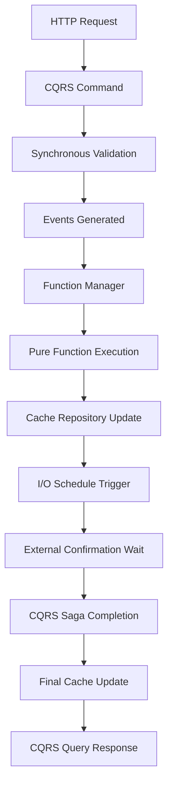

# Cross-Pattern Integration Workflows

**Document Version:** 1.0  
**Date:** 2025-09-03  
**Context:** Complete workflows using multiple architectural patterns

## Overview

Cross-Pattern Integration shows how **all architectural patterns work together** in complete business workflows. This demonstrates the **unified architecture** where CQRS, Function Manager, I/O Scheduling, and Cache Repositories coordinate to deliver complex crypto trading operations.

## Complete Crypto Trading Workflows

### 1. Yield Farming Strategy Execution (All Patterns)



#### Complete Implementation
```typescript
/**
 * Complete yield farming workflow using all patterns
 */
export class YieldFarmingWorkflow extends CryptoTradingServiceBase {
  private commandDispatcher: CommandDispatcher;
  private queryDispatcher: QueryDispatcher;
  private sagaOrchestrator: SagaOrchestrator;
  private portfolioCache: PortfolioCacheRepository;
  private riskCache: RiskCacheRepository;

  constructor() {
    super(infrastructure, 'yield-farming-workflow');
    
    this.commandDispatcher = new CommandDispatcher('yield-farming');
    this.queryDispatcher = new QueryDispatcher('yield-farming', infrastructure.cacheStore);
    this.sagaOrchestrator = new SagaOrchestrator('yield-farming', infrastructure.eventStore);
    this.portfolioCache = new PortfolioCacheRepository(infrastructure.cacheStore, this.logger);
    this.riskCache = new RiskCacheRepository(infrastructure.cacheStore, this.logger);
    
    this.registerCQRSHandlers();
  }

  /**
   * HTTP endpoint that orchestrates complete yield farming workflow
   */
  async executeYieldStrategy(request: YieldStrategyRequest): Promise<YieldStrategyResponse> {
    const businessContext = BusinessContextBuilder
      .forYieldFarming()
      .withAggregate('YieldStrategy', request.strategyId)
      .withUser(request.userId)
      .withAmount(request.amountUsd)
      .build();

    return this.executeBusinessOperation('yield_strategy_workflow', businessContext, async (context) => {
      
      // Step 1: CQRS Query - Get current portfolio (fast from cache)
      const currentPortfolio = await this.queryDispatcher.executeQuery('GetPortfolioQuery', {
        userId: request.userId,
        includeRiskMetrics: true
      }, businessContext);

      if (!currentPortfolio.success) {
        return { success: false, error: 'Failed to get portfolio data' };
      }

      // Step 2: CQRS Command - Validate and plan strategy (synchronous)
      const strategyCommand = await this.commandDispatcher.executeCommand('PlanYieldStrategyCommand', {
        strategyId: request.strategyId,
        userId: request.userId,
        currentPortfolio: currentPortfolio.data,
        targetProtocols: request.targetProtocols,
        amountUsd: request.amountUsd,
        riskTolerance: request.riskTolerance
      }, businessContext);

      if (!strategyCommand.success) {
        return { success: false, error: strategyCommand.error };
      }

      // Step 3: Start CQRS Saga - Long-running execution workflow
      const sagaResult = await this.sagaOrchestrator.startSaga('YieldExecutionSaga', {
        strategyId: request.strategyId,
        userId: request.userId,
        executionPlan: strategyCommand.result,
        approvalRequired: request.amountUsd > 100000 // Whale approval
      }, businessContext);

      // Step 4: I/O Schedule - Monitor execution progress
      await this.scheduleExecutionMonitoring(request.strategyId, sagaResult.sagaId);

      return {
        success: true,
        strategyId: request.strategyId,
        sagaId: sagaResult.sagaId,
        executionPlan: strategyCommand.result,
        estimatedCompletion: Date.now() + 300000, // 5 minutes
        status: 'execution_started'
      };
    });
  }

  /**
   * I/O Scheduling integration
   */
  private async scheduleExecutionMonitoring(strategyId: string, sagaId: string): Promise<void> {
    // Schedule periodic execution status checks
    await this.sendCommand(
      'io-schedule-manager',
      'RegisterEventSchedule',
      {
        scheduleId: `monitor-${strategyId}`,
        triggerEventType: 'YieldExecutionStepCompleted',
        delayMs: 60000, // Check 1 minute after each step
        maxExecutions: 10, // Stop after 10 checks
        ioFunction: {
          name: 'monitorYieldExecution',
          parameters: { strategyId, sagaId }
        }
      },
      this.createSystemBusinessContext()
    );

    // Schedule timeout fallback
    await this.sendCommand(
      'io-schedule-manager',
      'RegisterTimeSchedule',
      {
        scheduleId: `timeout-${strategyId}`,
        cronPattern: `0 */10 * * * *`, // Every 10 minutes
        maxExecutions: 1,
        ioFunction: {
          name: 'checkYieldExecutionTimeout',
          parameters: { strategyId, sagaId, timeoutThreshold: 600000 } // 10 min timeout
        }
      },
      this.createSystemBusinessContext()
    );
  }

  private registerCQRSHandlers(): void {
    // Register command handlers
    this.commandDispatcher.registerHandler({
      commandType: 'PlanYieldStrategyCommand',
      timeout: 5000,
      retryPolicy: { maxRetries: 2, backoffMs: 1000, retryableErrors: [] },
      
      validate: (command: any) => ({
        isValid: command.amountUsd > 0 && command.targetProtocols.length > 0,
        violations: []
      }),
      
      handle: async (context, command) => {
        // Send planning request to Function Manager
        const planningResult = await context.sendCommand(
          'function-manager',
          'ExecuteFunction',
          {
            functionType: 'planYieldStrategy',
            eventType: 'YieldStrategyPlanRequested',
            data: {
              userId: command.userId,
              currentPortfolio: command.currentPortfolio,
              targetProtocols: command.targetProtocols,
              amountUsd: command.amountUsd,
              riskTolerance: command.riskTolerance
            }
          }
        );

        return {
          success: planningResult.success,
          result: planningResult.result,
          events: planningResult.success ? [{
            eventId: `strategy-planned-${command.strategyId}`,
            eventType: 'YieldStrategyPlanned',
            streamId: `yield-strategy-${command.strategyId}`,
            timestamp: new Date().toISOString(),
            data: planningResult.result,
            metadata: { source: 'yield-strategy-command' }
          }] : [],
          executionTime: planningResult.executionTime,
          commandId: context.commandId
        };
      }
    });

    // Register query handlers
    this.queryDispatcher.registerHandler({
      queryType: 'GetPortfolioQuery',
      timeout: 2000,
      cachePolicy: { enabled: true, ttlSeconds: 60, refreshOnAccess: false, staleWhileRevalidate: true },
      
      validate: (query: any) => ({
        isValid: !!query.userId,
        violations: []
      }),
      
      handle: async (context, query) => {
        // Fast read from cache repository
        const portfolio = await this.portfolioCache.getPortfolio(query.userId);
        const riskMetrics = query.includeRiskMetrics ? 
          await this.riskCache.getUserRisk(query.userId) : null;

        return {
          success: true,
          data: {
            ...portfolio,
            riskMetrics
          },
          executionTime: 3,
          queryId: context.queryId,
          fromCache: true
        };
      }
    });
  }
}
```

### 2. Cross-Exchange Arbitrage Detection (Multi-Pattern)

```typescript
/**
 * Arbitrage workflow using Function Manager + I/O Scheduling + CQRS
 */
export class ArbitrageDetectionWorkflow extends CryptoTradingServiceBase {
  
  async handlePriceUpdate(event: PriceUpdateEvent): Promise<void> {
    return this.handleDomainEvent(event, async (event, context) => {
      
      // Send price analysis to Function Manager
      const arbitrageAnalysis = await this.sendCommand(
        'function-manager',
        'ExecuteFunction',
        {
          functionType: 'analyzeArbitrageOpportunity',
          eventType: 'ArbitrageAnalysisRequested',
          data: {
            priceUpdate: event.data,
            timeWindow: 30000, // 30 second opportunity window
            minProfit: 0.005 // 0.5% minimum profit
          }
        },
        context.businessContext
      );

      if (arbitrageAnalysis.success && arbitrageAnalysis.result.opportunityDetected) {
        
        // Trigger I/O scheduling for time-sensitive execution
        await this.scheduleArbitrageExecution(arbitrageAnalysis.result);
        
        // Update cache with opportunity
        await this.updateArbitrageCache(arbitrageAnalysis.result);
      }
    });
  }

  private async scheduleArbitrageExecution(opportunity: ArbitrageOpportunity): Promise<void> {
    // Schedule immediate execution check
    await this.sendCommand(
      'io-schedule-manager',
      'RegisterConditionalSchedule',
      {
        scheduleId: `arbitrage-${opportunity.opportunityId}`,
        conditionCheck: 'checkArbitrageProfitability',
        checkIntervalMs: 5000, // Check every 5 seconds
        maxExecutions: 6, // Stop after 30 seconds
        ioFunction: {
          name: 'executeArbitrageIfProfitable',
          parameters: { opportunity }
        }
      },
      this.createSystemBusinessContext()
    );

    // Schedule cleanup if opportunity expires
    await this.sendCommand(
      'io-schedule-manager', 
      'RegisterTimeSchedule',
      {
        scheduleId: `cleanup-${opportunity.opportunityId}`,
        cronPattern: `${new Date(Date.now() + 60000).getSeconds()} * * * * *`, // 1 minute from now
        maxExecutions: 1,
        ioFunction: {
          name: 'cleanupExpiredArbitrage',
          parameters: { opportunityId: opportunity.opportunityId }
        }
      },
      this.createSystemBusinessContext()
    );
  }
}
```

### 3. Risk Management Integration (All Patterns)

```typescript
/**
 * Risk management using CQRS + Function Manager + Cache + Scheduling
 */
export class RiskManagementWorkflow extends CryptoTradingServiceBase {
  
  async handleHighRiskDetected(event: HighRiskDetectedEvent): Promise<void> {
    return this.handleDomainEvent(event, async (event, context) => {
      
      // Immediate CQRS command for risk mitigation
      const mitigationCommand = await this.commandDispatcher.executeCommand('ExecuteRiskMitigationCommand', {
        userId: event.data.userId,
        riskLevel: event.data.riskLevel,
        immediateActions: event.data.recommendedActions,
        severity: event.data.severity
      }, context.businessContext);

      if (mitigationCommand.success) {
        
        // Start saga for complex risk reduction workflow
        const riskReductionSaga = await this.sagaOrchestrator.startSaga('RiskReductionSaga', {
          userId: event.data.userId,
          targetRiskLevel: 'medium',
          currentRiskLevel: event.data.riskLevel,
          mitigationPlan: mitigationCommand.result
        }, context.businessContext);

        // Schedule continuous monitoring
        await this.scheduleRiskMonitoring(event.data.userId, riskReductionSaga.sagaId);
        
        // Update risk cache
        await this.riskCache.updateUserRisk(event.data.userId, {
          ...event.data,
          mitigationStarted: Date.now(),
          sagaId: riskReductionSaga.sagaId
        });
      }
    });
  }

  private async scheduleRiskMonitoring(userId: string, sagaId: string): Promise<void> {
    // Schedule risk level monitoring every 5 minutes
    await this.sendCommand(
      'io-schedule-manager',
      'RegisterConditionalSchedule',
      {
        scheduleId: `risk-monitor-${userId}`,
        conditionCheck: 'checkRiskLevelImprovement',
        checkIntervalMs: 300000, // 5 minutes
        cooldownMs: 900000, // 15 minute cooldown
        ioFunction: {
          name: 'monitorRiskReduction',
          parameters: { userId, sagaId }
        }
      },
      this.createSystemBusinessContext()
    );
  }
}
```

## Integration Flow Patterns

### Pattern 1: Command → Function Manager → Cache → Query
```typescript
// 1. HTTP Request triggers CQRS Command
POST /api/portfolio/rebalance
  ↓
// 2. Command Handler validates and generates events
@CommandHandler('RebalancePortfolioCommand')
  ↓ (events)
// 3. Function Manager processes events with pure functions  
FunctionManager.processIncomingEvent()
  ↓ (results)
// 4. Cache Repository updates projections
PortfolioCacheRepository.updatePortfolio()
  ↓ (cached)
// 5. Query Handler returns fast results
@QueryHandler('GetPortfolioQuery') → sub-millisecond response
```

### Pattern 2: Event → I/O Schedule → Function Manager → Saga
```typescript
// 1. Domain event triggers I/O schedule
'TradeSubmittedToBlockchain' event
  ↓
// 2. I/O Schedule Manager waits for confirmation
@IOSchedule('blockchain-confirmation-check')
  ↓ (confirmation received)
// 3. Triggers Function Manager for final calculations
FunctionManager.executeFunction('finalizeTradeCalculation')
  ↓ (calculation complete)
// 4. Saga handles multi-step finalization
@SagaHandler('TradeFinalizeWorkflow')
```

### Pattern 3: Saga → Command → Function Manager → Schedule
```typescript
// 1. Saga step triggers CQRS command
SagaStep: 'execute_position_entry'
  ↓
// 2. Command validates and queues
@CommandHandler('ExecutePositionEntryCommand')
  ↓ (validation passed)
// 3. Function Manager executes position logic
FunctionManager.executeFunction('calculatePositionEntry')
  ↓ (position calculated)
// 4. Schedule monitoring for position confirmation
@IOSchedule('position-confirmation-monitor')
```

## Benefits of Cross-Pattern Integration

### Complete Business Workflow Support
- ✅ **Immediate responses**: CQRS commands provide instant feedback
- ✅ **Fast queries**: Redis cache repositories enable sub-ms reads
- ✅ **Complex coordination**: Sagas handle multi-step workflows
- ✅ **Pure computation**: Function Manager optimizes business logic
- ✅ **Scheduled operations**: I/O scheduling handles time-based and external operations

### Performance Optimization
- ✅ **Latency**: Commands <10ms, Queries <1ms, Functions load-balanced
- ✅ **Throughput**: Each pattern optimized for its specific use case
- ✅ **Resource efficiency**: Load balancing across optimal shards
- ✅ **Caching**: Smart cache invalidation and warming strategies

### Operational Excellence  
- ✅ **Observability**: Every pattern includes full tracing and metrics
- ✅ **Error handling**: Consistent error handling across all patterns
- ✅ **Recovery**: Automatic recovery and compensation logic
- ✅ **Monitoring**: Built-in health checks and performance monitoring

## Testing Cross-Pattern Integration

### Integration Testing Strategy
```typescript
/**
 * Test complete workflows across multiple patterns
 */
describe('Cross-Pattern Integration', () => {
  
  it('should execute complete yield farming workflow', async () => {
    // 1. Setup test infrastructure
    const workflow = new YieldFarmingWorkflow();
    
    // 2. Execute HTTP request simulation
    const request: YieldStrategyRequest = {
      strategyId: 'yield-001',
      userId: 'user-123', 
      targetProtocols: ['aave', 'compound'],
      amountUsd: 50000,
      riskTolerance: 'medium'
    };
    
    const response = await workflow.executeYieldStrategy(request);
    
    // 3. Verify CQRS command executed
    expect(response.success).toBe(true);
    expect(response.strategyId).toBe('yield-001');
    
    // 4. Verify Function Manager processing
    await testUtils.waitForFunctionExecution('planYieldStrategy');
    
    // 5. Verify Cache Repository updates
    const updatedPortfolio = await workflow.portfolioCache.getPortfolio('user-123');
    expect(updatedPortfolio?.lastUpdated).toBeDefined();
    
    // 6. Verify I/O Scheduling activated
    const activeSchedules = await workflow.getActiveSchedules();
    expect(activeSchedules.some(s => s.includes('monitor-yield-001'))).toBe(true);
  });
});
```

This cross-pattern integration enables **complete crypto trading workflows** that leverage all architectural patterns working together seamlessly.